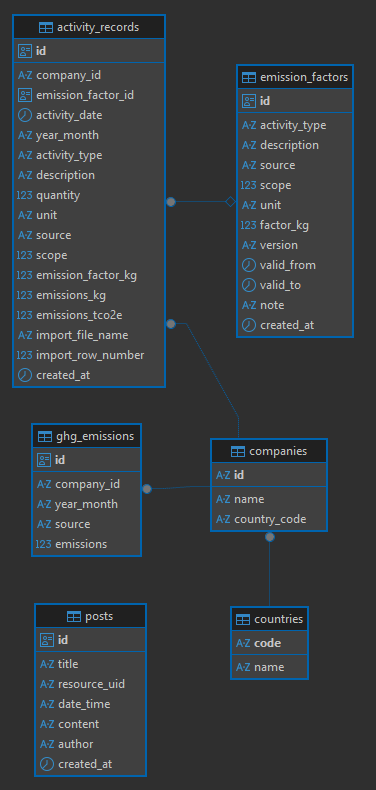
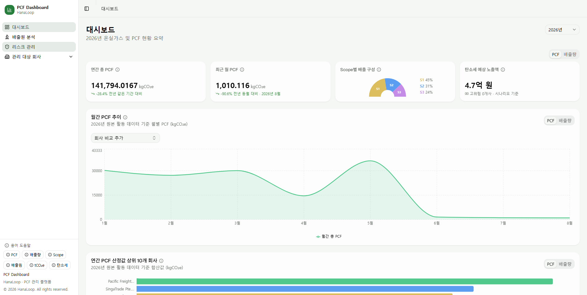
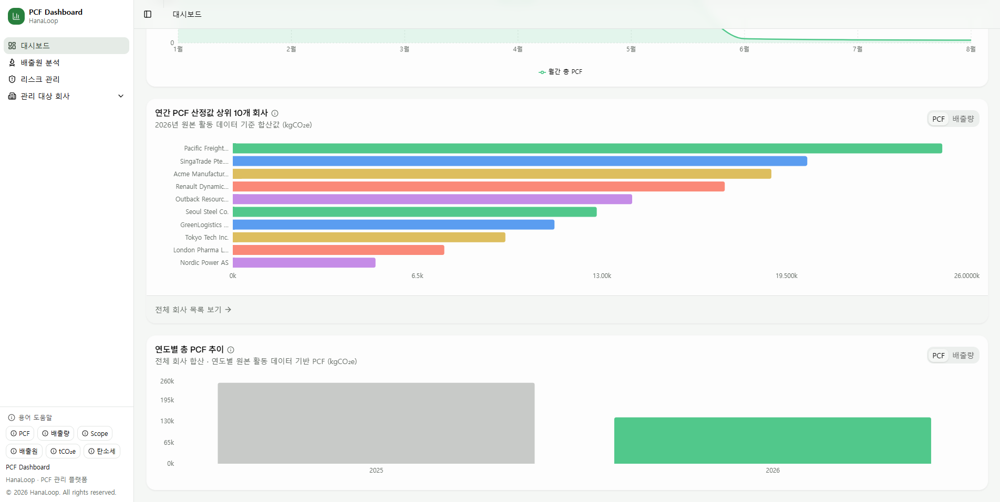
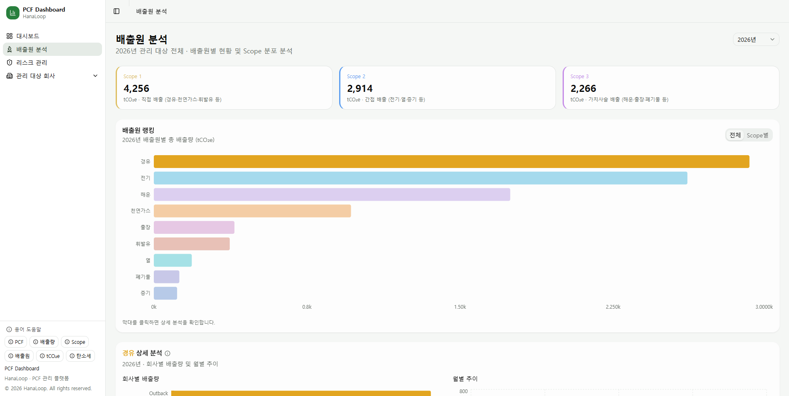
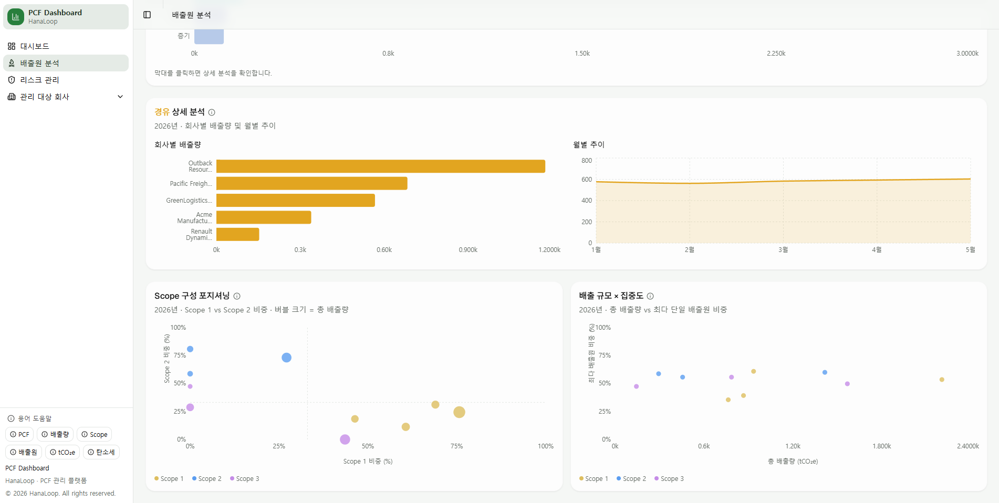
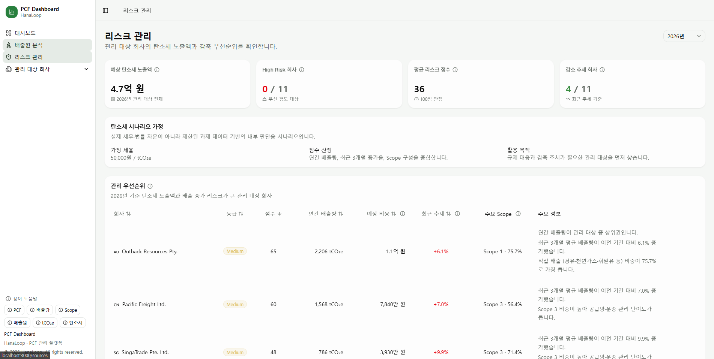
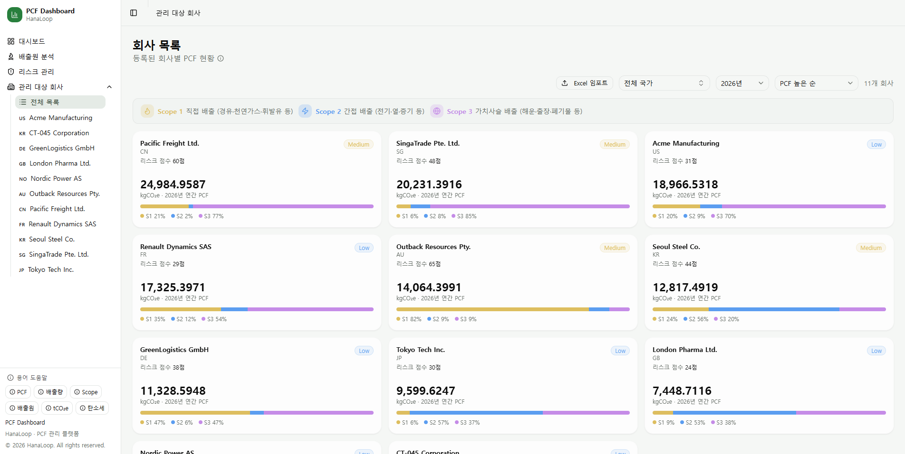
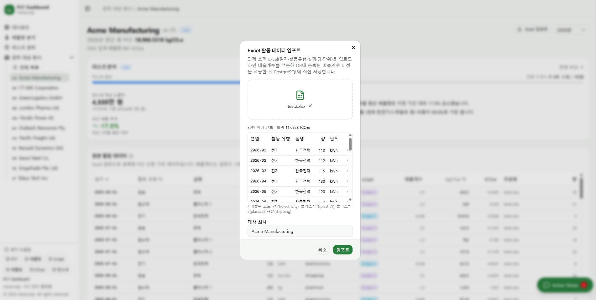
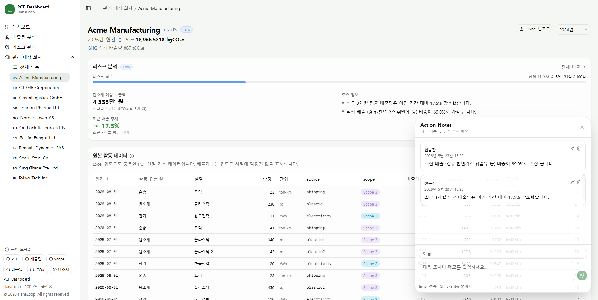

# PCF DASHBOARD

> 여러 회사의 온실가스 배출 현황과 활동 데이터 기반 PCF 산정 결과를 모니터링하는 대시보드입니다.

---

## 도메인 개념

### PCF

PCF(Product Carbon Footprint, 제품 탄소 발자국)는 제품 단위에서 발생하는 온실가스 배출량을 CO₂ 환산량으로 계산한 값입니다.

PCF는 원래 ISO 14067, GHG Protocol Product Standard에 따라 제품 기능 단위와 생애주기 경계를 정의한 뒤 산정해야 합니다. 
다만 과제 데이터에는 제품 생산수량과 전체 LCA 경계 정보가 없으므로, 이 프로젝트에서는 제공된 활동 데이터에 배출계수를 적용해 PCF 산정 배출량을 계산했습니다.

```txt
PCF(kgCO₂e) = 활동량 × 배출계수(kgCO₂e/unit)
```

### GHG 배출량

GHG 배출량은 회사 단위로 집계된 온실가스 배출 현황입니다.

이 서비스에서는 회사별·월별·배출원별로 이미 집계된 GHG 배출 데이터를 사용하며, 단위는 `tCO₂e`입니다.

### GHG Scope

GHG Protocol 기준에 따라 배출원을 Scope 1/2/3으로 구분합니다.

| Scope | 의미 | 해당 배출원 예시 |
| --- | --- | --- |
| Scope 1 | 직접 배출 — 직접 연소하는 연료 | 휘발유, 경유, LPG, 천연가스 |
| Scope 2 | 간접 배출 — 구매한 전기·열·증기 | 전기, 열, 증기 |
| Scope 3 | 가치사슬 전반 — 공급망·운송·출장 등 | 운송, 출장, 폐기물 |

---

## 실행 방법

**사전 준비**: Docker Desktop 설치 (Windows·Mac 필수), 3000번·5432번 포트 미사용

1. `.env.example`을 복사해 `.env`를 생성합니다.

   ```bash
   # macOS/Linux
   cp .env.example .env

   # Windows
   copy .env.example .env
   ```

2. Docker Compose로 실행합니다.

   ```bash
   docker compose up --build
   ```

3. 브라우저에서 `http://localhost:3000`으로 접속합니다.

---

## 기술 스택

| 영역 | 기술                               | 선택 이유                                                    |
| --- |----------------------------------|----------------------------------------------------------|
| Framework | Next.js 15 App Router, React 19  | Route Handler와 페이지 라우팅을 한 프로젝트 안에서 구성하기 위해               |
| Language | TypeScript strict                | 배출량, Scope, PCF 계산처럼 데이터 형태가 중요한 영역의 오류를 줄이기 위해          |
| UI | Tailwind CSS v4, shadcn/ui       | 접근성 기본값과 일관된 디자인 토큰을 활용하기 위해                             |
| Chart | Recharts                         | 대시보드 차트 구현 속도와 커스터마이징 균형을 맞추기 위해                         |
| Server State | TanStack Query v5                | 서버 데이터 캐싱, 낙관적 업데이트, 실패 롤백을 명확히 분리하기 위해                  |
| URL State | nuqs                             | 연도·국가·배출원 필터를 URL에 보존해 새로고침과 링크 공유를 지원하기 위해              |
| Database | PostgreSQL, postgres npm package | 회사·배출량·Action Notes·활동 데이터·배출계수 버전 이력을 관계형 테이블로 관리 |
| Infra | Docker, Docker Compose           | 평가자가 별도 DB 설치 없이 동일한 실행 환경을 만들 수 있게 하기 위해                |
| Test | Vitest                           | 배출량 집계, 리스크 산정, 포맷, Excel 파싱 같은 순수 함수를 빠르게 검증하기 위해       |

---

## 아키텍처

```txt
Postgres
    ↓
Next.js Route Handlers (/api/**)
    ↓
TanStack Query hooks
    ↓
Content components
    ↓
Charts / Cards / Tables
```

| 상태 | 관리 방식 | 예시 |
| --- | --- | --- |
| 서버 데이터 | TanStack Query | 회사, 국가, Action Notes, 활동 데이터 |
| URL 필터 | nuqs | 연도, 국가, 배출원 |
| 로컬 UI 상태 | React state | 탭, 다이얼로그, 슬라이더, 편집 상태 |

---

## 데이터 모델

핵심 테이블은 다음과 같습니다.



| 테이블 | 역할 |
| --- | --- |
| `countries` | 국가 코드와 국가명 |
| `companies` | 관리 대상 회사 |
| `ghg_emissions` | 회사 단위 월별/source별 GHG 배출량 결과 |
| `posts` | 회사별 Action Notes |
| `emission_factors` | 활동 유형·설명·단위별 배출계수와 버전 이력 |
| `activity_records` | Excel 원본 활동 데이터, 사용한 계수, 계산 결과 스냅샷 |

---

## 주요 기능과 화면
* 시연 영상은 과제 제출 메일의 압축 파일로 첨부하였습니다.

### 대시보드 페이지

- 전체 관리 대상 회사의 총 PCF, GHG 배출량, Scope 1/2/3 구성, 월별 추이, 연도별 비교
- 경영자가 빠르게 볼 수 있는 KPI와 리스크 요약





### 배출원 분석 페이지

- 배출원별 랭킹
- Scope 항목별 상세 분석 차트





### 리스크 관리 페이지

- 회사별 리스크 점수와 등급
- 예상 배출권 구매비용
- 최근 배출 증가/감소 추세
- 관리 우선순위 테이블

#### 리스크 점수

회사별 리스크 점수는 세 가지 요소를 합산해 산정합니다.

- 연간 총 배출량 (절대 규모)
- 최근 3개월 배출 증가 추세
- Scope 3 비중 (공급망 리스크)

점수에 따라 High / Medium / Low 등급으로 구분하고 관리 우선순위를 표시합니다.

#### 배출권 비용 산정
`50,000원 / 배출권`을 가정 단가로 사용합니다. 1 tCO₂e를 배출권 1개로 환산하며, 경영자가 어느 회사를 먼저 관리해야 하는지 비용 기준으로 판단할 수 있도록 예상 배출권 구매비용을 함께 표시합니다. 무상할당·보유 배출권을 고려하지 않은 단순 시나리오입니다.




### 회사 목록 페이지

- 관리 대상 회사 카드 목록
- 국가, 연도, 정렬 필터
- 회사별 PCF 수치, Scope 구성과 리스크 뱃지
- Excel 파일 import로 활동 데이터 업로드





### 회사별 상세정보 페이지

- 특정 회사의 상세 수치 정보를 표시
- 월별 배출 추이와 PCF 활동 데이터
- Scope 1/2/3 감축 시나리오
- Action Notes 패널로 회사별 대응 기록 관리

* Action Notes API는 제공된 Fake Backend의 명세와 동일하게 15% 실패 확률을 재현했습니다.




---

## 과제 요구사항 대응

| 요구사항 | 대응                                                                                      |
| --- |-----------------------------------------------------------------------------------------|
| PCF 계산 결과 시각화 | Excel 활동 데이터를 `activity_records`에 저장하고 Dashboard/Company Detail에서 PCF 산정 결과와 활동 데이터를 시각화 |
| 데이터 값 정확성·단위 표시 | PCF 산정값은 `kgCO₂e`, GHG 배출량은 `tCO₂e`로 표시                                                 |
| 입력 오류 시 에러 메시지 | Excel import 파싱 실패, 회사 미선택, 배출계수 미매칭, 저장 실패를 toast/error state로 표시                      |
| README 로컬 실행 5단계 이내 | Docker 기준 `cp .env.example .env` → `docker compose up --build` → 브라우저 접속으로 실행 가능        |
| README AI 사용 내역 | `AI 사용 내역` 섹션에 AI가 보조한 부분과 개발자가 직접 결정한 부분을 분리해 기록                                       |
| README 시스템 설명·설계 | `아키텍처`, `데이터 모델`, `주요 설계 결정` 섹션으로 구조와 설계 근거 설명                                          |
| ERD/스키마 다이어그램 | README 데이터 모델 섹션에 DB 구조 정리                                                              |
| Docker Compose 실행 | `docker-compose.yml`로 app과 PostgreSQL을 함께 실행                                            |
| Excel import | Companies 페이지에서 Excel 업로드, 미리보기, 저장 흐름 제공                                               |
| 시연 자료 | README에는 페이지별 스크린샷을 포함하고, 페이지별 시연 영상은 제출 압축 파일에 별도 포함                                   |

---

## 주요 설계 결정

### 사용자 목적 중심 페이지 설계

경영자·실무자를 대상으로 데이터를 보여주는 것에 그치지 않고 의사결정을 지원하는 것을 목표로 설정했습니다. **배출원 분석** 페이지에서 어떤 배출원이 PCF·GHG에 영향을 주는지 파악하고, **리스크 관리** 페이지에서 배출권 비용 시나리오로 비용 리스크를 인식하며, **회사별 상세정보**에서 배출원 감축 시 배출권 비용 절감 예상까지 확인할 수 있도록 페이지를 구성했습니다.

### 도메인 접근성 설계

GHG·PCF 개념이 생소한 사용자도 맥락 없이 수치를 이해할 수 있도록, 도메인 용어 설명을 별도 섹션으로 분리하고 차트마다 도움말을 배치했습니다.

### 트레이드오프 — Recharts 동적 임포트

차트 컴포넌트는 `next/dynamic`으로 지연 로드하고 `ssr: false`를 적용했습니다. Recharts가 초기 번들에 포함되면서 주요 페이지의 First Load JS가 커졌고, 차트는 화면의 핵심 요소지만 텍스트·KPI보다 먼저 로드될 필요는 없다고 판단했습니다.

| 페이지 | 최적화 전 | 최적화 후 | 감소량 |
| --- | --- | --- | --- |
| `/` | 320 kB | 179 kB | -141 kB (-44%) |
| `/companies/[id]` | 315 kB | 198 kB | -117 kB (-37%) |
| `/sources` | 302 kB | 167 kB | -135 kB (-45%) |

초기 JS를 줄여 KPI와 텍스트가 먼저 보이게 한 반면, 차트 청크를 별도로 내려받는 추가 네트워크 요청이 발생합니다. 이를 보완하기 위해 Skeleton 높이를 재사용해 차트 로딩 중 레이아웃 시프트를 줄였습니다.

### 트레이드오프 — 상태 관리 계층 분리

상태를 TanStack Query(서버 데이터) · nuqs(URL 필터) · React state(로컬 UI) 세 계층으로 분리했습니다. 각 상태의 성격에 맞는 도구를 선택해 역할을 명확히 하고, 필터 상태를 URL에 보존해 새로고침·링크 공유가 가능하도록 했습니다.

대신 레이어가 세 개로 나뉘어 전역 store 하나로 관리하는 방식보다 초기 구조 파악 비용이 높습니다. 페이지 간 공유가 필요한 클라이언트 상태가 늘어나면 Zustand 도입을 다시 검토해야 합니다.

---

## AI 사용 내역
Claude Code와 Codex를 함께 사용했습니다. AI는 구현 속도를 높이는 보조 도구로 사용했고, 서비스 구현 방향성 및 도메인 해석과 아키텍처 결정 등은 직접 결정했습니다.

- **AI가 보조한 부분**: 컴포넌트 초안 생성, 컴포넌트 분리/공통화 시 코드 작성, 테스트 케이스 보강, Dockerfile 작성 보조, 설계 방향과 트레이드오프에 대한 대안 검토/조언
- **개발자가 결정한 것**: 사용자 유형 해석, 페이지 구조 정의, 리스크 산식 설정, PCF/GHG 데이터 분리, 빌드 및 배포 방식 설정 등 서비스 방향성과 아키텍처에 관한 핵심 설계 결정
- **AI 생성 코드 검토**: 변경 후 `pnpm build`, `pnpm test:run`, Docker build를 통해 검증하고, 실제 화면 렌더링과 인터랙션 확인

### 사용한 주요 Prompt 예시

- 이 과제는 단순 차트 구현보다 탄소 도메인을 이해하고 설명하는 게 중요해. 사용자는 경영자와 실무자로 설정하고, 여러 회사의 GHG 배출 현황과 PCF 산정 결과를 빠르게 이해하는 방향으로 서비스를 만들려고 생각 중이야. 이때 대시보드(메인), 회사별 페이지, 배출원 분석 페이지, 리스크 분석 페이지로 나누는 구성이 자연스러운지 검토해줘.
- Recharts가 초기 번들에 포함되어 First Load JS가 커지므로 LCP랑 TTI에 영향을 주고있어. 차트 컴포넌트는 next/dynamic으로 지연 로드해줘.
- Docker 제출 환경은 평가자가 별도 DB를 설치하지 않아도 실행 가능해야 해. Dockerfile은 Node 22 LTS 기반으로 작성하고, docker-compose는 PostgreSQL과 앱을 함께 띄우며, DB 계정과 비밀번호는 .env에서 주입하도록 구성해.

---

## 소요 시간

| 단계                                   | 소요 |
|--------------------------------------| --- |
| 과제 요구사항 분석, GHG/PCF 도메인 정리           | 약 0.5일 |
| Dashboard, Companies, Company Detail 기본 화면 구현 | 약 1일 |
| Risk, 배출원 분석 화면 구현                   | 약 1일 |
| Posts 기능 구현(Action Notes, 낙관적 업데이트, 실패 롤백 처리) | 약 0.5일 |
| PostgreSQL 전환, Route Handler, Docker Compose 구성 | 약 0.5일 |
| Excel import, 배출계수 DB 조회             | 약 0.5일 |
| 테스트, 빌드 검증, 문서 정리                    | 약 1일 |

---
